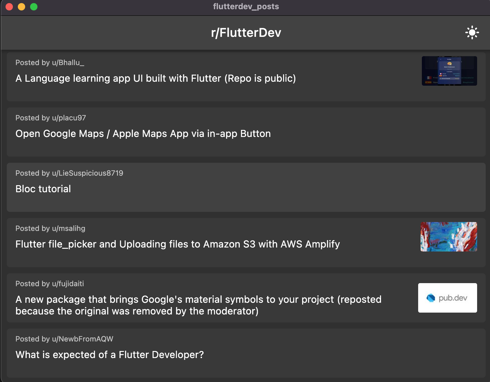
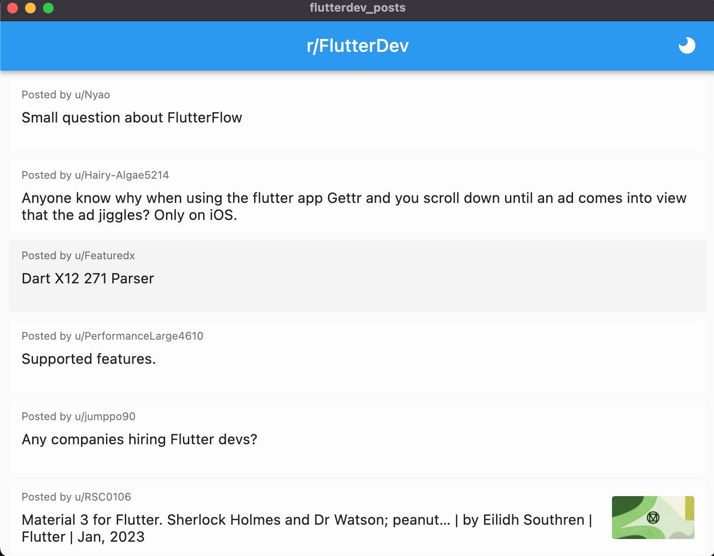

# flutterdev_posts

A simple application for displaying last 25 posts on [FlutterDev](https://www.reddit.com/r/FlutterDev/).

## Description
  
  State management: [Riverpod](https://pub.dev/packages/flutter_riverpod)\
  Caching: [Hive](https://pub.dev/packages/hive)\
  Connectivity: [connectivity_plus](https://pub.dev/packages/connectivity_plus)\
  Image caching: [cached_network_image](https://pub.dev/packages/cached_network_image)\
  Http requests: [http](https://pub.dev/packages/http)\
  Markdown formatting: [flutter_markdown](https://pub.dev/packages/flutter_markdown)

## Showcase

  
  

